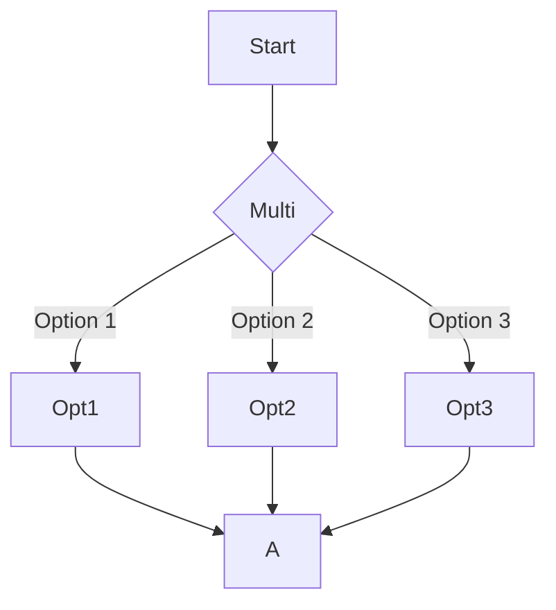

# testgithubactions

```mermaid
flowchart TD
  A[Start] --> B{Multi};
  B -- Option 1 --> C[Opt1];
  B -- Option 2 --> D[Opt2];
  B -- Option 3 --> E[Opt3];
  C --> F[A];
  D --> F[A];
  E --> F[A];
```

Tes